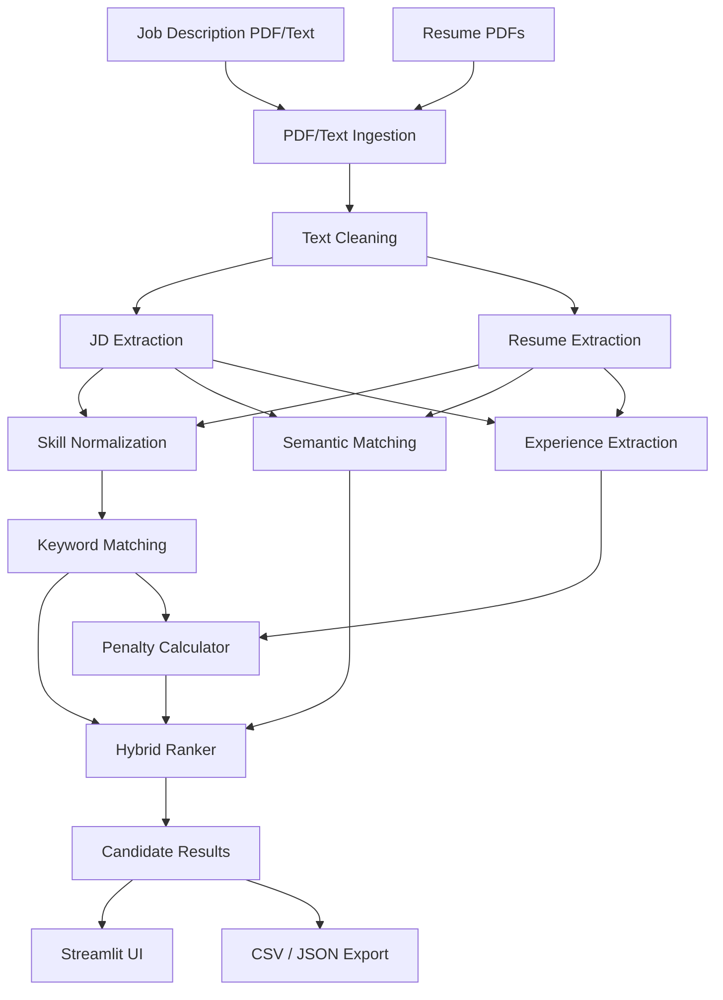

# Resume & Job Description Ranking Engine

> A technical explanation of how the system works, why it was designed this way, and where it can be improved.

---

## How to Use This Document

This document explains the engineering decisions behind the Smart Shortlisting Engine. It is written for developers, technical interviewers, and system architects who want to understand the "why" behind the code. 

You can read it end-to-end, or jump to specific sections:
- **[The Architecture](#system-architecture):** How data flows through the pipeline.
- **[The Core Engines](#the-tripartite-scoring-engine):** How Keyword Matching, Semantic Matching, and Penalties work together.
- **[The "Why"](#why-hybrid-matching-instead-of-one-method):** Why we combine multiple imperfect signals instead of relying on a single AI model.
- **[Limitations & Trade-offs](#where-the-system-can-be-wrong):** Where the system breaks and what we chose not to build.

---

## The Problem

Recruiters spend hours manually comparing hundreds of resumes against a Job Description (JD). Automating this comparison is difficult because human language is inconsistent.

Consider a JD that asks for:
`Experience building REST APIs using FastAPI and PostgreSQL.`

And a resume that states:
`Developed backend services and HTTP APIs using Python with relational databases.`

**The Keyword Problem:**
An exact keyword matcher will fail this candidate. They never wrote "FastAPI" or "PostgreSQL". But any human engineer knows this candidate is highly relevant.

**The Semantic Problem:**
Conversely, consider a candidate whose resume is just a giant list:
`Python, FastAPI, PostgreSQL, Docker, AWS, Kubernetes, React, Java, C++`
A purely semantic embedding model might look at this list, see high vector overlap with the JD, and rank this candidate #1—even if the candidate has zero actual experience applying those tools.

**The Experience Problem:**
A brilliant fresh graduate and a seasoned senior developer might use the exact same vocabulary on their resumes. If the role strictly requires 5 years of experience, vocabulary alone cannot distinguish them.

**The Solution:**
We need an engine that understands exact technical constraints (keywords), transferable concepts (semantics), and hard career realities (experience), and we need it to explain its math so a recruiter can trust it.

---

## The Central Design Idea

The central idea of this project is to deliberately combine several imperfect, complementary signals instead of pretending one "black box" signal is sufficient.

The architecture isolates the scoring into three distinct pillars:

1. **Keyword Evidence:** Did the candidate use the exact required tools (or their semantic equivalents)?
2. **Semantic Evidence:** Does the candidate's experience contextually match the JD's responsibilities?
3. **Experience Evidence:** Does the candidate meet the hard temporal requirements of the role?

The final formula is simple:
```text
Keyword Matcher 
        + 
Semantic Matcher 
        - 
Penalties (Experience Gap + Missing Critical Skills) 
        = 
Final Ranking
```

By keeping these components isolated, the system remains entirely explainable. We never have to guess why a model gave someone a "95%".

---

## System Architecture



### Data Flow
1. **Ingestion**: PDFs are converted to raw text.
2. **Cleaning**: Whitespace is normalized, but technical tokens (`Node.js`, `C++`) are carefully preserved.
3. **Extraction**: Raw text is converted into structured `JobDescription` and `Resume` models. Skills are extracted and normalized. Dates are parsed into years of experience.
4. **Scoring**: The Keyword Matcher, Semantic Matcher, and Penalty Calculator run independently.
5. **Ranking**: The Hybrid Ranker combines the sub-scores into a final, clamped percentage.
6. **Presentation**: The Streamlit UI displays the leaderboard alongside deterministic explanations for every score.

---

## Project Structure

The repository is modularized by domain responsibility:

- `ingestion/`: Responsible for reading PDFs and normalizing text strings. Should not contain any scoring logic.
- `extraction/`: Responsible for turning raw strings into structured data (Extractors, Normalizers). Should not contain ranking weights.
- `app/matching/`: The core scoring algorithms (Keyword, Semantic, Penalty, Hybrid). 
- `app/bias/ & app/qa/`: Bonus hackathon features operating on the extracted data.
- `app/main.py`: The Streamlit frontend and application orchestration.
- `tests/`: Isolated verification for every component in the pipeline.
- `models/` (via `app.models`): The Pydantic/Dataclass data structures passing between layers.

---

## PDF Ingestion

### What
The system uses `pypdf` to extract text from uploaded PDF files, running in a dedicated `extract_pdf_text_cached` function.

### Why
Recruiters work in PDFs. Isolating this layer ensures that if we later decide to support `.docx` or use a different PDF library, the extraction and scoring engines remain untouched.

### Trade-offs & Limitations
The current approach relies on basic text extraction. It fails silently on image-only (scanned) PDFs. 

### Alternatives
**OCR (Tesseract):** We could have added OCR to handle scanned resumes. 
*Why not used?* It introduces heavy C++ dependencies, drastically slows down processing, and is generally out of scope for a weekend hackathon where standard digital PDFs are the norm.

**External Parsing APIs (AWS Textract, Google Document AI):**
*Why not used?* The hackathon emphasized a standalone, local solution. Adding cloud APIs introduces latency, API keys, network dependency, and potential privacy issues with candidate PII.

---

## Text Cleaning

### What
The `TextCleaner` sanitizes inputs. It standardizes quotation marks and whitespace. Crucially, it uses a custom regex token pattern to prevent technical terms from being destroyed.

### Why
Naïve text normalization (like stripping all punctuation) destroys technical meaning. If you strip punctuation, `Node.js` becomes `Node js`, `C++` becomes `C`, and `CI/CD` becomes `CI CD`. The cleaner ensures these tokens survive the journey to the extractors.

### Alternatives
**spaCy / NLTK Tokenizers:** We could use a statistical NLP tokenizer.
*Why not used?* Standard English tokenizers often fail on niche technical acronyms out-of-the-box. A fast, regex-based cleaner targeted strictly at preserving our known technical vocabulary is faster and perfectly reliable for this pipeline's scope.

---

## Job Description Extraction

### What
The `JDExtractor` parses the JD text to find required skills, preferred skills, and section boundaries (e.g., "Responsibilities" vs "Qualifications"). 

### Why
Section context dictates scoring weight. A skill found under "Required Skills" is mandatory. A skill found under "Our Tech Stack" might just be contextual. 

### Alternatives
**Zero-Shot LLM Extraction:** We could pass the JD to a local LLM and ask it to output a JSON schema of requirements.
*Why not used?* LLMs are non-deterministic, slow, and prone to hallucinations. They make unit testing incredibly difficult. By using regex and a centralized taxonomy, extraction is 100% deterministic and instantaneous.

---

## Resume Extraction

### What
The `ResumeExtractor` parses candidate resumes. It extracts explicit skills and parses date ranges to calculate total years of experience.

### Why
We need to map the unstructured resume into a predictable `Resume` data model.

### The Power of "We Don't Know"
If the extractor cannot find a specific date range or an explicit "X years" statement, it defaults to `0.0`. It does *not* try to guess based on the length of the resume. In a ranking system, it is safer to confidently state "I could not find experience data" than to guess incorrectly and penalize or reward a candidate arbitrarily.

---

## Skill Normalization

### What
The `SkillNormalizer` maintains a central `TECH_SKILLS_VOCAB` and a `SYNONYMS_MAP`. It ensures that `React.js` and `react` both resolve to `react`. 

Crucially, it also maintains a `RELATED_SKILLS_GRAPH` to handle semantic equivalence (e.g., `Express` fulfills a `Node.js` requirement).

### Why
We explicitly do **not** equate distinct technologies like `Java` and `JavaScript`, or `Python` and `Django`. False positives in skill normalization destroy recruiter trust faster than missed synonyms. If a recruiter searches for a Python developer and the system equates it with JavaScript, the system is useless.

### Alternatives
**Fuzzy String Matching (Levenshtein distance):** 
*Why not used?* It is dangerous for tech. `Java` and `JavaScript` have high string overlap but are entirely different ecosystems. 

**Word Embeddings (Word2Vec):**
*Why not used?* While embeddings know `Docker` and `Kubernetes` are related, they might score them as identical, bypassing the recruiter's explicit requirement for Docker. Exact canonical equivalence is safer for the explicit *Keyword Matcher*, leaving fuzzy relationships to the *Semantic Matcher*.

---

## Keyword Matching

### What
The `KeywordMatcher` checks the candidate's canonical skills against the JD's required and preferred skills. 

Formula:
```text
Keyword Score = (Required Skill Match % × 0.70) + (Preferred Skill Match % × 0.30)
```

### How Semantic Equivalence Works Here
If the JD requires `Node.js`, but the candidate only explicitly lists `Express`, the `KeywordMatcher` checks the `RELATED_SKILLS_GRAPH`. It identifies `Express` as a valid semantic equivalent and grants the candidate a match, logging `semantic_equivalent` in the evidence provenance.

### Why
Keyword matching acts as the baseline checklist. Even with advanced AI, recruiters still need to know: *Did this person check the specific boxes the hiring manager asked for?*

---

## Keyword Stuffing

### The Problem
If Candidate A writes `Python Python Python`, they shouldn't score higher than Candidate B who wrote `Python` once.

### The Solution
Our extraction pipeline heavily utilizes Python `set()` comprehensions. Skills are canonicalized and deduplicated immediately. A candidate gets a binary `Matched` or `Missing` status for a requirement. Mentioning `Docker` 15 times yields the exact same Keyword Score as mentioning it once.

### The Remaining Weakness
A candidate can still write a "skills dump" at the bottom of their resume (`Python, Docker, AWS, React`) without having actual experience using them. This is exactly why the **Semantic Matcher** exists—to verify if their actual job descriptions contextually align with the JD.

---

## Semantic Matching

### What
The `SemanticMatcher` uses Sentence-Transformers to compare the *meaning* of the candidate's resume against the JD.

### How
1. It splits the JD into sentence chunks.
2. It assigns weights to those chunks (`required: 1.0`, `preferred: 0.60`, `responsibilities: 0.30`, `general: 0.10`).
3. It encodes both the JD chunks and the Resume text into vector embeddings.
4. It calculates the cosine similarity for every JD chunk against the closest matching resume chunk.
5. It applies a noise threshold (zeroing out weak matches) and averages the weighted scores.

### Why
Lexical (keyword) matching fails on paraphrases. If a JD asks for "Experience building REST APIs," and the candidate writes "Developed highly scalable backend HTTP services," the semantic matcher will recognize the strong conceptual overlap and reward the candidate, even though the vocabulary differs.

---

## Why `all-MiniLM-L6-v2`?

### What
We use `sentence-transformers/all-MiniLM-L6-v2` loaded locally.

### Why this approach
It is a fast, lightweight (under 100MB) embedding model that runs comfortably on a standard CPU. It provides excellent baseline semantic similarity for English text without requiring an external API.

### Alternatives
**OpenAI / External API Embeddings:**
*Why not used?* It violates the hackathon constraint of relying on black-box APIs, introduces network latency, and raises privacy concerns with sending candidate resumes to a third party.

**Larger Local Models (e.g., MPNet, Llama 3):**
*Why not used?* They require significant RAM and GPUs to run fast enough for a real-time Streamlit UI. MiniLM strikes the perfect balance for a local, interactive demo.

---

## Semantic Noise Threshold

### What
Cosine similarity mathematically almost never returns `0.0`. Even completely unrelated sentences might have a baseline similarity of `0.10` to `0.20`. 

The equation:
```python
calibrated = (raw_sim - noise_threshold) / (1.0 - noise_threshold)
```

### Why
If a candidate has a resume about gardening, and the JD is for a Python developer, the baseline similarity of every sentence might be `0.15`. If we average fifty sentences at `0.15`, the candidate gets a 15% semantic score for being a gardener. By setting a `noise_threshold` (e.g., `0.18`), we clamp background noise to `0.0`.

*Note: This threshold is an engineering heuristic derived from benchmark testing, not a scientifically proven absolute. It works well for this specific model.*

---

## Experience Extraction & Penalty

### What
The `ResumeExtractor` parses date patterns (e.g., `Jan 2018 - Dec 2020`) and computes the candidate's total years of experience. The `PenaltyCalculator` then evaluates the gap against the JD's requirements.

### The Penalty Formula
```text
Gap = max(0, Required Years - Candidate Years)
Experience Penalty = min(Gap × 0.05, 0.20)
Missing Skills Penalty = Missing Required Skills × 0.05

Total Penalty = Experience Penalty + Missing Skills Penalty
```

### Why a Penalty instead of a Positive Score?
If experience was a massive positive multiplier, an average developer with 20 years of experience would infinitely outrank a brilliant developer with 3 years of experience. 

By bounding experience as a *penalty*, we say: "The candidate's technical skills dictate their base relevance. If they don't have enough time-in-seat or missed critical requirements, we deduct a fixed, limited amount of points to reflect the risk." This keeps excellent freshers competitive while respecting the hiring manager's temporal requirements.

---

## Hybrid Ranking

### What
The `HybridRanker` is the orchestrator that combines the three isolated signals.

```text
Base Score = (Keyword Score × 0.40) + (Semantic Score × 0.60)
Final Score = clamp(Base Score - Total Penalty, 0.0, 1.0)
```

### Why this approach
The score is strictly **candidate-independent**. Candidate A's score is calculated entirely based on Candidate A's fit to the JD. 

### Why not min-max normalization or z-scores?
If we normalized scores across the batch (e.g., giving the best candidate in the batch 100%), the system becomes volatile. A candidate might be an 80% fit on Monday, but drop to a 50% fit on Tuesday just because 5 better resumes were uploaded. Hiring managers need a stable metric representing objective fit to the role, not relative fit to a specific upload batch.

---

## Why Hybrid Matching Instead of One Method?

| Approach | Strength | Weakness |
| :--- | :--- | :--- |
| **Keyword Only** | Highly precise. Easy to explain. Validates exact constraints. | Punishes paraphrasing. Blind to context. Easy to game (keyword stuffing). |
| **Semantic Only** | Understands context and transferable concepts. Resilient to synonyms. | Generates false positives. Hard to explain. Often misses strict brand-name requirements. |
| **Experience Only**| Fulfills HR time-in-seat requirements. | Completely ignores technical competency and skill relevance. |
| **Hybrid** | Balances strict constraints (keywords/penalties) with contextual understanding (semantics). | Requires careful calibration of weights to ensure one signal doesn't drown the others. |

We use a Hybrid approach because hiring is a hybrid problem.

---

## Score Calibration and Adversarial Testing

The repository includes a robust `tests/test_ranking_audit.py` suite (Phase 5).

### What it proves
- **Candidate Independence:** Batch evaluations yield the exact same score as single evaluations.
- **Score Monotonicity:** A candidate with identical skills but more experience always outranks the lesser experienced candidate.
- **Adversarial Resilience:** A candidate with zero required keywords but high semantic similarity is heavily penalized and kept at a low rank.

### What it does NOT prove
The benchmark demonstrates that our *math and architecture behave as intended*. It does **not** prove that the system makes perfect real-world hiring decisions, as that would require evaluating the engine against thousands of human-labeled historical hiring outcomes. 

---

## Explainability

### What
Every `CandidateResult` includes detailed `ScoreDiagnostics`, a `PenaltyBreakdown`, and a `KeywordScoreBreakdown`. The Streamlit UI surfaces exactly which skills were matched, which were missed, and the exact formula used to calculate the score.

### Why
Explainability isn't just a UI feature to satisfy hackathon judges. It is an operational requirement. When the algorithm returns a surprising result, developers use the breakdowns to debug extraction logic, and recruiters use the breakdowns to verify they didn't write a confusing JD.

---

## Data Models

### What
We use standard Python Dataclasses (e.g., `JobDescription`, `Resume`, `CandidateResult`) instead of passing loose dictionaries around.

### Why
Strict schemas prevent entire classes of runtime bugs (e.g., `KeyError` typos). They define explicit contracts between the extraction layer and the scoring layer, making unit testing trivial. We chose standard `dataclasses` over `Pydantic` to keep the dependency footprint light, as we don't require complex network validation for a local pipeline.

---

## Streamlit Application

### What
`app/main.py` is the frontend UI. It handles file uploads, parses them, runs the hybrid ranker, and displays a responsive leaderboard.

### Design Decisions
- **Caching (`@st.cache_data`)**: Text extraction from PDFs is slow. We cache the text extraction so that if the recruiter tweaks the Semantic vs Keyword weights, the ranking recalculates instantly without re-parsing the PDFs.
- **Prioritization**: The UI immediately shows the "Top 3 Spotlight" followed by the full leaderboard. Recruiters shouldn't have to scroll through 18 resumes to find the winner; the system highlights the actionable data immediately.

---

## Testing Strategy

The pipeline is heavily tested via `pytest`:
- **Unit Tests:** Verify individual regex parsers and math functions (`test_penalty_calculator.py`).
- **Integration Tests:** Verify that Keyword and Semantic matchers combine correctly in the Hybrid Ranker (`test_hybrid_ranker.py`).
- **Adversarial Audits:** Synthetic fixtures designed specifically to try and "break" the scoring logic (e.g., testing `Node.js` vs `Django` false positives, or testing a completely irrelevant candidate).

---

## Where the System Can Be Wrong

We deliberately acknowledge the following limitations:

### 1. OCR Absence
If a candidate submits an image-based scanned PDF, `pypdf` will extract zero text, and the candidate will score 0%.
### 2. Ambiguous Experience
Regex is brittle. If a candidate writes "Two and a half years working on X," our parser will miss it because it's looking for digits (`2.5`). 
### 3. Semantic Hallucinations
Embeddings operate in latent space. Sometimes, two sentences are mathematically close but practically irrelevant.
### 4. Poor Job Descriptions
If a recruiter uploads a JD that says "Seeking a rockstar," with no technical requirements, the system has no structured data to extract, and the resulting scores will be arbitrary. 

---

## What I Would Fix Next

If this project were funded for another month of development, I would prioritize:

| Priority | Improvement | Why | Difficulty |
| :--- | :--- | :--- | :--- |
| **High** | Real Labeled Evaluation Set | We need to measure our rankings against actual human HR decisions to tune the weights scientifically. | High |
| **Medium** | Better Experience Parsing | Integrate a lightweight NLP model (like spaCy) to extract dates and durations more reliably than regex. | Medium |
| **Medium** | Configurable UI Thresholds | Let recruiters define custom penalties (e.g., "Must have exactly 5 years, or immediate disqualification"). | Low |
| **Low** | OCR Integration (Tesseract) | To gracefully handle scanned PDFs. | Medium |

---

## Alternatives We Did Not Use

- **LLM-Based Parsing (ChatGPT/Gemini):** Too expensive, non-deterministic, and violates data privacy by sending candidate PII to third-party clouds.
- **Vector Database (Pinecone/Chroma):** Overkill. We are comparing 18 resumes against 1 JD in memory. A vector database is designed for searching millions of documents. Numpy matrix multiplication in RAM is significantly faster and simpler for this scale.
- **Microservices (FastAPI + React):** Unnecessary operational overhead for a local ranking pipeline. Streamlit handles both the UI and the Python execution loop seamlessly.

---

## Why This Architecture is Not More Complex

The system deliberately lacks a database, a REST API, authentication, and cloud dependencies. 

Why? Because the core requirement was to build an *explainable ranking algorithm*. A more complex architecture would have added operational cost, deployment friction, and latency without actually improving the quality of the candidate ranking. We focused 100% of the engineering effort on the data structures and scoring math.

---

## Security / Privacy

The entire pipeline runs **100% locally**.
- The `all-MiniLM-L6-v2` model is downloaded once and runs on local CPU.
- Uploaded PDFs are processed in memory and immediately discarded when the Streamlit session ends.
- No candidate data is sent to OpenAI, Google, or any external API. 

---

## The Two-Minute Explanation

*If I had to explain this project to a judge in two minutes:*

Recruiters waste hours reading resumes because traditional keyword scanners are too rigid, and modern AI wrappers are too opaque. Our goal was to build a Smart Shortlisting Engine that understands context but proves its math.

We architected a Tripartite Scoring Engine. First, the **Keyword Matcher** checks strict constraints—did they use the required technologies? We built a semantic equivalence graph into this layer, so if the JD asks for *Node.js* and the candidate has *Express*, the engine is smart enough to give them full credit. Second, the **Semantic Matcher** uses a local embedding model to evaluate context. It reads the sentences in the resume to see if the candidate's actual experience conceptually aligns with the JD's responsibilities, catching transferable skills that keyword scanners miss. 

Finally, the **Penalty Calculator** grounds the score in reality. If a candidate doesn't meet the years-of-experience requirement, or is missing a critical must-have skill, we explicitly subtract points. 

We wrap all of this in a hybrid formula and surface it in a Streamlit dashboard. The dashboard doesn't just show a final percentage; it shows the exact mathematical breakdown, the missing skills, and the semantic evidence. It runs 100% locally, protects candidate privacy, and ensures that a recruiter can defend every single ranking decision the system makes.

---

## Technical Glossary

- **Embedding:** A mathematical array of numbers representing the meaning of a sentence.
- **Cosine Similarity:** A math formula that measures how close two embeddings are (1.0 means identical meaning, 0.0 means unrelated).
- **Canonical Skill:** The standardized name for a technology (e.g., `React.js` becomes `react`).
- **Semantic Equivalence:** Recognizing that two different words satisfy the same requirement (e.g., `Express` satisfies `Node.js`).
- **Noise Threshold:** A cutoff point to ignore low-quality semantic matches.
- **Provenance:** The exact source location (e.g., "Found in the Experience section") used to prove why a score was awarded.
